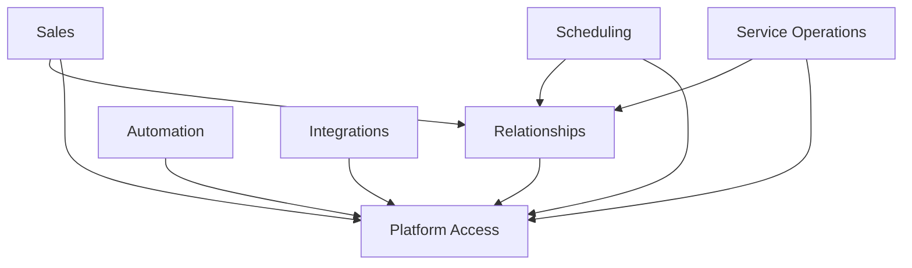

# Grafo de dependências entre Modules

Platform Access não depende de Modules opcionais; Relationships depende apenas de contratos do Platform Access; Sales, Scheduling e Service Operations dependem de Platform Access e Relationships. Automation e Integrations dependem do Platform Access e consomem contratos ou eventos dos Modules habilitados. Modules essenciais nunca dependem de opcionais, e ciclos são proibidos.

