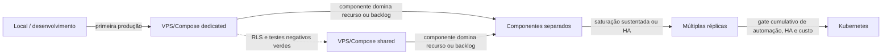

# Matriz ortogonal de Deployment e capacidade

Este documento consolida `EL-29` a partir dos contratos de capacidade (`EL-89`) e responsabilidades (`EL-90`). Deployment é sempre uma combinação de três dimensões independentes:

- **Isolation Mode:** `shared` ou `dedicated`;
- **Operations Mode:** `managed` ou `self-hosted`;
- **Runtime:** `local`, `VPS/Compose` ou `Kubernetes`.

Mudar qualquer dimensão não altera regras de domínio, ownership dos Modules, schema lógico ou versão do produto.

## Legenda de disponibilidade

- **Fundação:** configuração usada para desenvolvimento e validação atual.
- **Alvo:** configuração arquitetural prevista para a primeira operação produtiva.
- **Condicional:** depende de gate técnico explícito.
- **Futuro:** não deve ser implementada ou mantida antes das evidências requeridas.
- **Não aplicável:** combinação sem significado operacional no contexto atual.

## Aplicabilidade das combinações

| Isolation Mode | Operations Mode | Local | VPS/Compose | Kubernetes |
| --- | --- | --- | --- | --- |
| `shared` | `managed` | Não aplicável | Condicional ao gate de RLS | Futuro; gates de RLS e Kubernetes |
| `shared` | `self-hosted` | Não aplicável | Condicional ao gate de RLS | Futuro; gates de RLS e Kubernetes |
| `dedicated` | `managed` | Não aplicável | Alvo da primeira produção | Futuro; gate de Kubernetes |
| `dedicated` | `self-hosted` | Não aplicável | Alvo self-hosted | Futuro; gate de Kubernetes |

O Runtime local é uma configuração de desenvolvimento sob responsabilidade do desenvolvedor; por isso não recebe Operations Mode comercial. Ele pode exercitar os dois Isolation Modes em testes, mas não constitui operação managed ou self-hosted.

## Configurações de referência

| Referência | Estado | Componentes | Isolamento e persistência | Operação e backup | Custo relativo |
| --- | --- | --- | --- | --- | --- |
| Desenvolvimento local | Fundação | Web, API, worker, PostgreSQL, Temporal e storage de desenvolvimento; Compose quando útil | Infraestrutura pode ser compartilhada; dados são descartáveis; testes podem exercitar `shared` e `dedicated` | Desenvolvedor opera; sem garantia produtiva de backup ou disponibilidade | Baixo |
| Managed dedicated em VPS/Compose | Alvo inicial | Proxy/TLS, Web, API, worker, PostgreSQL, Temporal, object storage, observabilidade e rotina de backup | Database tenant-owned exclusivo, preservando `tenant_id`; control plane pode permanecer central | Operador AdaptCRM; backup criptografado off-host por 30 dias, PITR, RPO `<= 15 min`, RTO `<= 4 h` e restore drill trimestral | Médio |
| Managed shared em VPS/Compose | Condicional | Mesmos componentes e artefatos do managed dedicated | Database/schema compartilhados com `tenant_id`, TenantContext e RLS validada | Operador AdaptCRM com o mesmo baseline de backup; restore seletivo exige procedimento validado | Baixo por Tenant; maior custo de isolamento e operação |
| Self-hosted dedicated em VPS/Compose | Alvo | Mesmos artefatos OCI e serviços; endpoints externos definidos pela organização | Database exclusivo com o mesmo schema e `tenant_id` | Organização opera host, TLS, database, storage, secrets, monitoramento, backup e incidentes; produto fornece migrations, runbooks e diagnóstico | Médio para a organização |
| Self-hosted shared em VPS/Compose | Condicional | Mesmos componentes do self-hosted dedicated | Compartilhamento permitido somente após gate de RLS e testes negativos | Organização assume isolamento e define retenção, RPO/RTO e restore drill; produto fornece contrato e diagnóstico | Baixo por Tenant; maior risco operacional do operador |
| Managed dedicated em Kubernetes | Futuro | Web/API/worker com réplicas conforme necessidade; ingress, probes e configuração externa; PostgreSQL, Temporal e storage permanecem duráveis e externos ao processo | Database tenant-owned exclusivo e control plane roteando para a persistência dedicada | Operador AdaptCRM responde por cluster, database e baseline managed completo | Alto |
| Managed shared em Kubernetes | Futuro e condicional | Os mesmos componentes Kubernetes do modo dedicated | Database/schema compartilhados; exige RLS e testes negativos antes do gate Kubernetes | Operador AdaptCRM responde pelo cluster e pelo isolamento compartilhado | Alto; menor custo unitário somente com escala comprovada |
| Self-hosted dedicated em Kubernetes | Futuro | Mesmos artefatos OCI, probes e contratos; organização escolhe e opera a distribuição | Database tenant-owned exclusivo com o mesmo schema e `tenant_id` | Organização opera cluster e dependências; suporte não recebe acesso permanente a host ou secrets | Alto para a organização |
| Self-hosted shared em Kubernetes | Futuro e condicional | Mesmos componentes do self-hosted dedicated | Database/schema compartilhados; depende dos gates de RLS e Kubernetes | Organização responde pelo cluster e isolamento; produto fornece contratos e diagnóstico | Alto para a organização; menor custo unitário condicionado à escala |

## Artefatos invariáveis e configuração variável

| Permanece idêntico | Varia por ambiente ou combinação |
| --- | --- |
| Código-fonte e versão do produto | Valores de configuração de processo |
| Imagens OCI de Web/API/worker identificadas por SemVer e commit SHA | Endpoints de PostgreSQL, Temporal e object storage |
| Migrations e schema lógico | Secret provider, credenciais e política de rotação |
| Contratos REST/OpenAPI e regras de domínio | DNS, TLS e destinos de observabilidade |
| Health checks, readiness e shutdown gracioso | Réplicas, CPU, memória e tamanho dos pools |
| Modelo tenant-aware e ownership dos Modules | Roteamento `shared`/`dedicated` e topologia física |
| Procedimentos de upgrade e diagnóstico | Automação de backup, retenção, RPO/RTO e restore |

Configuração é externa ao artefato. Nenhuma combinação permite fork por Tenant, recompilação com secrets ou divergência de migrations.

## Requisitos mínimos de produção

| Área | Managed | Self-hosted |
| --- | --- | --- |
| Segurança | TLS, secrets externos, menor privilégio, patches e auditoria sob responsabilidade do operador AdaptCRM | Organização executa os mesmos controles; produto publica requisitos, compatibilidade e advisories |
| Observabilidade | Logs JSON sem PII/secrets, métricas sem `tenant_id` de alta cardinalidade, traces quando justificados e alertas operacionais | Produto emite os sinais; organização coleta, retém, alerta e fornece diagnóstico sanitizado |
| Backup | Baseline obrigatório do ADR-0049 | Organização declara retenção, RPO/RTO e frequência de restore drill antes de produção |
| Deploy | Promoção de artefato ready e rollback sem reversão destrutiva de schema | Organização aplica artefato, migrations e rollback conforme runbook versionado |
| Incidente | Operador AdaptCRM coordena infraestrutura e produto | Organização é responsável primária pela operação; produto corrige defeitos reproduzíveis |

## Evolução baseada em evidência

O diagrama representa decisões independentes, não uma migração obrigatória. Em particular, `shared` é uma opção de Isolation Mode e Kubernetes é uma opção futura de Runtime.

## Gatilhos de evolução

| Decisão | Evidência mínima |
| --- | --- |
| Scale-up | CPU, memória, pool, p95, backlog ou storage cruza o limiar de ação por 15 minutos após excluir regressão e configuração incorreta |
| Separar componentes | Um componente representa `>= 60%` do recurso saturado em três revisões, ou backlog cresce enquanto os demais componentes permanecem saudáveis |
| Scale-out | Componente stateless separado continua saturado, ou disponibilidade exige múltiplas réplicas; orçamento PostgreSQL permanece abaixo de `80%` de `max_connections` |
| Adotar Kubernetes | Todos os critérios do gate em `capacity-triggers.md`, incluindo necessidade recorrente de réplicas/HA, teste de carga, custo operacional e aprovação explícita |

Quantidade de Tenants nunca é gatilho suficiente. Toda evolução registra versão, carga, janela observada, baseline, custo, decisão e resultado posterior.

## Decisão para o primeiro Tenant

A referência inicial é **managed + dedicated + VPS/Compose**. Ela oferece persistência exclusiva e responsabilidade operacional clara sem depender do gate de RLS compartilhada ou do custo de Kubernetes. Self-hosted + dedicated + VPS/Compose usa os mesmos artefatos quando o pacote operacional self-hosted estiver pronto.

## Rastreabilidade

- ADR-0012 — Deployment em dimensões ortogonais.
- ADR-0018 — responsabilidades managed e self-hosted.
- ADR-0049 — baseline operacional managed.
- ADR-0053 — Runtime evolui sem Helm prematuro.
- [`Métricas e gatilhos de capacidade`](capacity-triggers.md) — `EL-89`.
- [`Responsabilidades por dimensões de Deployment`](deployment-responsibilities.md) — `EL-90`.
